# TP 1 : Modern Computer Vision

## Dépôt Git
Lien : https://github.com/riadh-lab-ux/CSC-8608-Concepts-avanc-s-et-applications-du-deep-learning

## Arborescence 

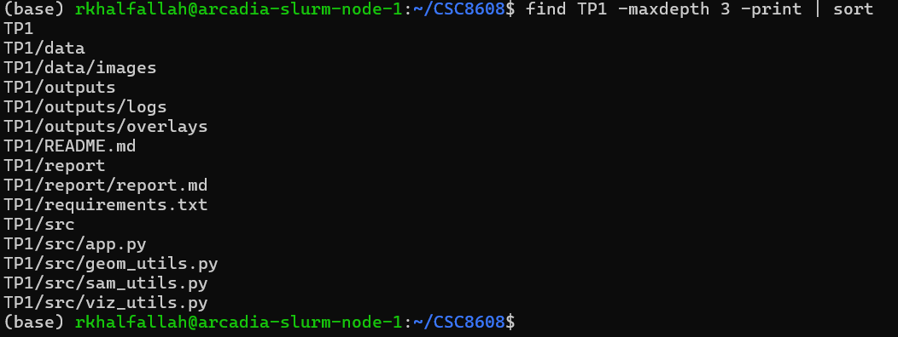

## Environnement d’exécution

- Exécution : noeud GPU via SLURM

- Machine :arcadia-slurm-node-1

- Accès GPU : srun --gres=gpu:2

## Environnement logiciel

- ENV activé : CSC8607 ( j'ai utilisé l'env du projet csc8607 car il contient les bibliothèques nécessaires)
- Versions : 
  
  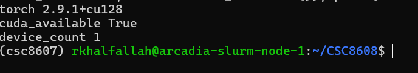
  
## Question 1 : Initialisation du dépôt, réservation GPU, et lancement de la UI via SSH

#### Preuve de fonctionnement de **segment_anything**

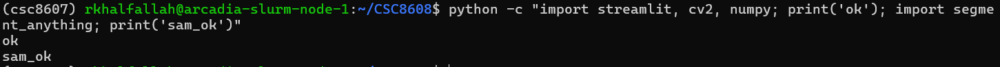

### Streamlit

#### Port : 8599

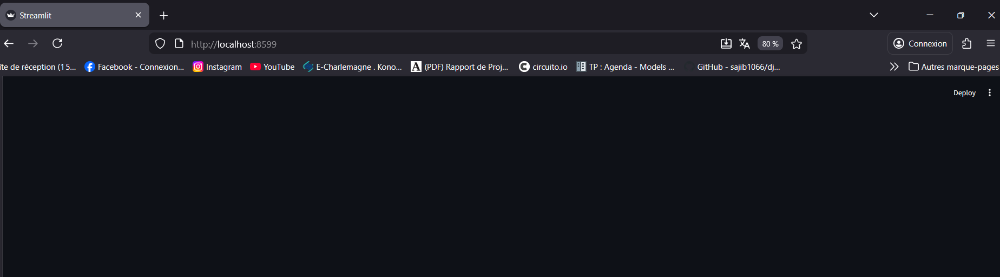

#### UI accessible via SSH tunnel : oui

## Exercice 2 : Constituer un mini-dataset (jusqu’à 20 images)

### images récupérées via recherche web
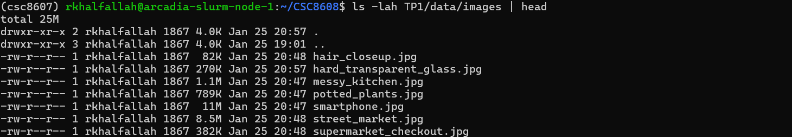
### Nombre d'images
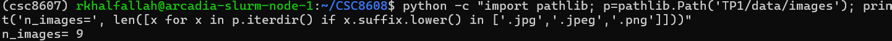

### 5 images représentatives

- 1/ wrench.jpg : Objet unique bien contrasté sur fond simple c'est un cas facile pour valider bbox et masque.

- 2/potted_plants.jpg : Formes organiques feuilles + détails fins c'est un bon test des bords irréguliers.

- 3/messy_kitchen.jpg : Scène très chargée textures et objets multiples dont on met en évidence les ambiguïtés de segmentation.

- 4/street_market.jpg : Beaucoup d’éléments et d’occlusions, personnes et objets c'est un cas réaliste multi-cibles.

- 5/supermarket_checkout.jpg : Scène très chargée avec plusieurs objets et personnes proches, un cas difficile où SAM peut confondre la cible avec des éléments voisins dans la bbox.

### Vignettes / captures

**Cas simple**

**Cas difficile**

## Exercice 3 : Charger SAM (GPU) et préparer une inférence “bounding box → masque”

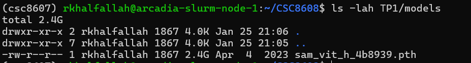

Modèle : vit_h

Checkpoint : sam_vit_h_4b8939.pth

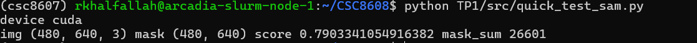

#### Commentaire d'un premier constat

Le modèle SAM se charge correctement sr l'image (480, 640, 3) et sur cette première exécution, le masque n’est pas vide =26601 et le score est satisfaisant =0.79. Les résultats dépendent fortement de la qualité de la bounding box dont la bbox trop large peut inclure du fond, trop serrée peut tronquer l’objet.

## Exercice 4 : Mesures et visualisation : overlay + métriques (aire, bbox, périmètre)

### Overlay produit

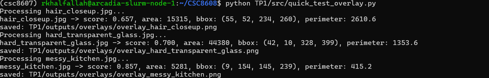

### Tableau récapitulatif
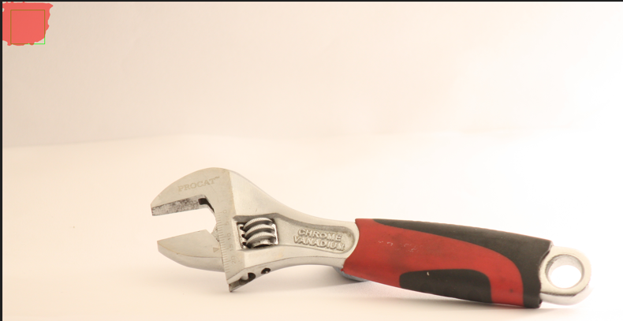

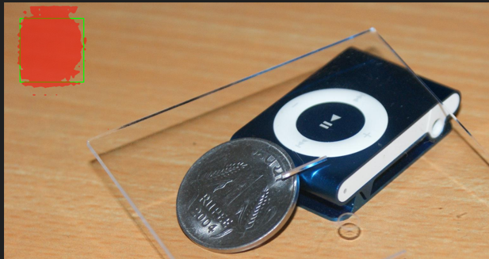

| Image | Score | Aire (px) | Périmètre (px) |
|---|---:|---:|---:|
| `wrench.jpg` | 0.848 | 64865 | 1127.4 |
| `messy_kitchen.jpg` | 0.857 | 5281 | 415.2 |
| `hard_transparent_glass.jpg` | 0.700 | 44380 | 1353.6 |

### commentaire

Sur hard_transparent_glass.jpg, le score seul (0.700) reste trop ambigu : il indique une confiance moyenne, mais ne montre pas ce que SAM a réellement segmenté. Avec l’overlay, on voit immédiatement si le masque colle bien au verre ou s’il absorbe une partie du fond (cr c'est fréquent avec des objets transparents). On peut alors trancher si l’erreur vient surtout de la bounding box (trop large ou mal positionnée) ou de la difficulté intrinsèque de la scène. L’overlay aide aussi à qualifier l’erreur de cible complètement à côté vs contours approximatifs.

## Exercice 5 : Mini-UI Streamlit : sélection d’image, saisie de bbox, segmentation, affichage et sauvegarde

### Cas simple 
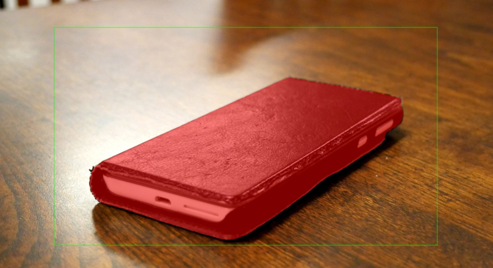

### Cas difficle 

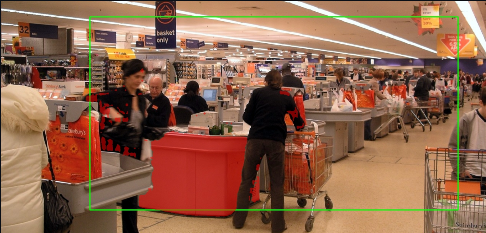

### Tableau des résultats de 3 tests

| Image | BBox (x1,y1,x2,y2) | Score | Aire  | Temps  |
|---|---|---:|---:|---:|
| `smartphone.jpg` | [448, 810, 3524, 2559] | 1.017 | 1854289 | 1776.6 |
| `supermarket_checkout.jpg` | [233, 260, 1198, 767] | 0.612 | 55689 | 1642.3 |
| `messy_kitchen.jpg` | [0, 0, 2581, 1625] | 0.671 | 583189 | 1699.1 |

### Debug

Quand on agrandit la bounding box, on donne plus de contexte à SAM dont le masque a tendance à grandir et peut parfois englober du fond ou même un objet voisin surtout sur des scènes chargées comme celle de  "mess_litchen", ce qui augmente l’aire et peut dégrader la précision visuelle. Quand on rétrécit la bbox, on contraint pus la segmentation : le masque devient souvent plus ciblé, mais si la bbox coupe l’objet ou est trop petite, le masque peut être tronqué. En pratique, la bonne bbox est un compromis o assez large pour contenir toute la cible mais assez serrée pour éviter les distracteurs.

## Exercice 6 : Affiner la sélection de l'objet : points FG/BG + choix du masque (multimask)

### cas 1 
#### Avant
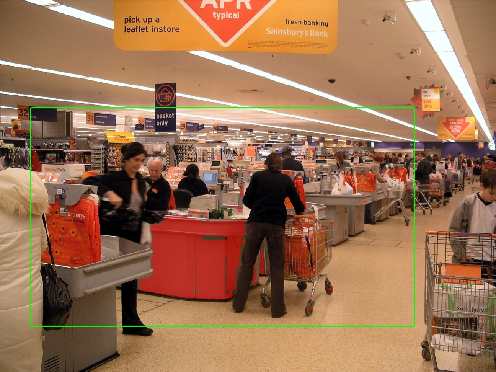

#### Après

index du masqsue : 1

- FG1 = (671, 547)

- FG2 = (436, 366)

le masque se recentre sur la zone d’intérêt autour de l’objet visé dans la bbox et réduit une partie des confusions.

### cas 2

#### Avant

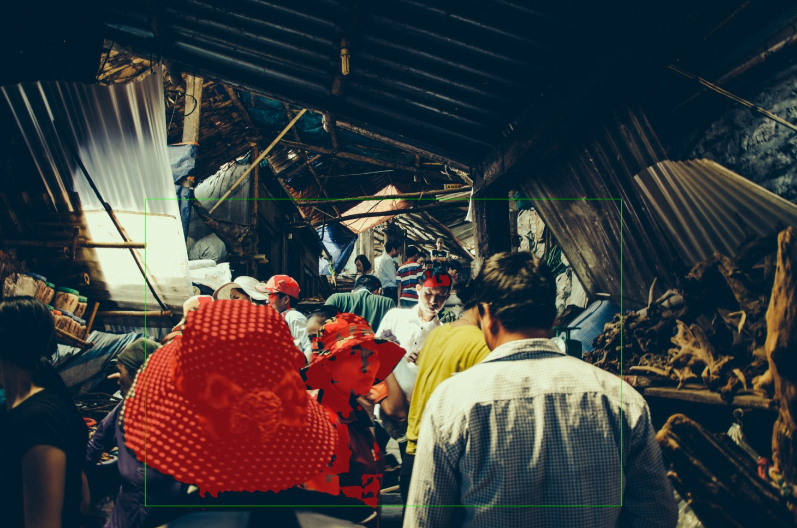

#### Après

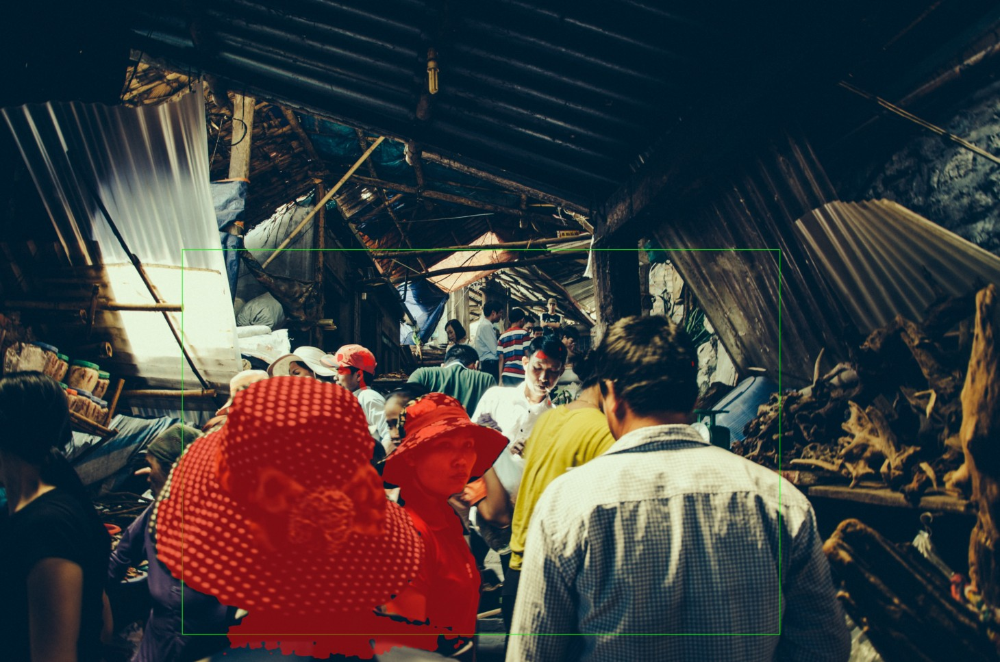

index du masque = 2

- FG1 = (2211, 2314)

- FG2 = (1576, 1870)

Le masque se recentre plus sur la zone d’intérêt au niveau des personnes dans la bbox, en réduisant partiellement les confusions avec d'autres éléments.

### L'importance des points BG

Les points BG deviennent indispensables quand la bounding box englobe plusieurs objets plausibles ou un fond très texturé : sans BG, le masque peut accrocher un élément dominant  au lieu de la cible. Ils sont particulièrement utiles pour exclure un objet parasite proche comme une personne ou un panneau ou pour nettoyer des zones de fond que SAM inclut systématiquement. Les BG aident aussi quand le masque déborde légèrement autour de l’objet : placer un BG sur la zone à retirer corrige rapidement la segmentation. Malgré cela, certains cas restent difficiles dont les objets fins comme cheveux ou cables, transparence ou faible contraste. Dans ces situations, même avec BG, plusieurs masques candidats peuvent rester plausibles et il faut parfois ajuster la bbox et tester plusieurs combinaisons de points.

## Exercice 7 : Bilan et réflexion (POC vers produit)

### Échecs principaux 

Dans mes essais, la segmentation échoue surtout dans trois situations concrètes observées sur la supermarket , la cuisine et l’image des personnes: 
- Sur les scènes chargées comme le supermarché, une bbox un peu large englobe plusieurs éléments et SAM segmente parfois l'arrière plan au lieu des personnes ou de l’objet visé. 
- La variété de textures et objets fait que le masque peut accrocher des zones inattendues et devenir très sensible à de petits changements de bbox.
- Les occlusions et la présence d’objets très saillants rendent la sélection ambiguë sans guidage.
  
-  Pour améliorer :
   -  **UI** : il faut rendre systématique la prévisualisation bbox + points et encourager l’usage de 1 point FG sur la cible et points BG pour exclure l’arrière-plan. 
   -  **Pipeline** :un post-traitement léger comme filtrer les petites composantes ou lisser les bords. 
   -  **Data** : Élargir le dataset avec plus d’images couvrant ces situations difficiles afin de ré-entraîner ou d’affiner le modèle.

### Industrialisation

Pour une intégration robuste en production, je prioriserais le suivi de :

- Image ID + résolution (W×H) : détecter un changement de format comme arrivée d’images très grandes et suivre l’évolution des résolutions dans le temps pour repérer du drift sur les données entrantes.

- Bounding box (x1,y1,x2,y2) : reproduire précisément un cas en erreur et analyser la distribution des tailles de bbox ou des bboxes trop petites ou trop larges expliquent souvent des masques tronqués ou qui capturent du fond.

- Points FG et BG  : mesurer la difficulté d’un cas et diagnostiquer pourquoi le modèle se trompe dont une hausse du nombre de BG requis peut indiquer une dégradation ou des images plus complexes.

- Scores multimask et index choisi : suivre l’hésitation du modèle (scores proches entre candidats)  q'une baisse globale des scores ou une forte variabilité peut signaler une régression après mise à jour ou un drift sur les scènes.

- Aire du masque et périmètre : repérer les anomalies de sortie et détecter des ruptures de distribution d’une période à l’autre.

- Taux de masques vides : alerter rapidement sur des prompts invalides comme bbox hors image ou un problème de pipeline.

