# TP2 : Génération d'image

## Exercice 1 : Mise en place & smoke test (GPU + Diffusers)

### Image générée
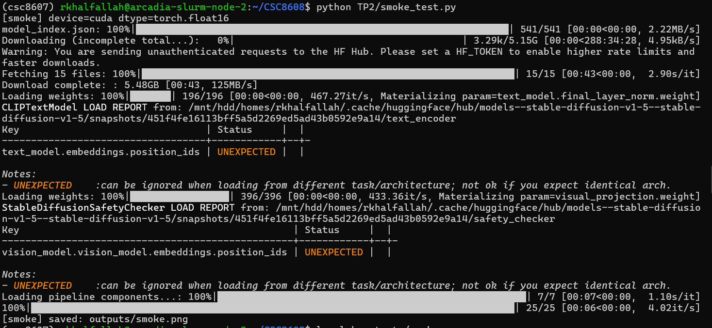

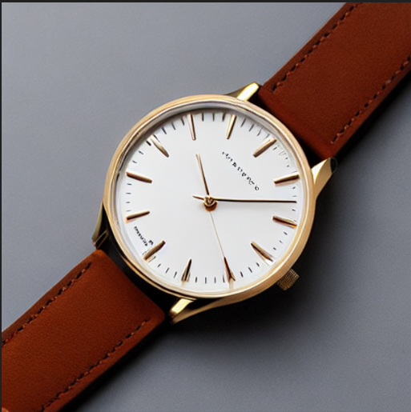

Génération OK : image sauvegardée dans `outputs/smoke.png` (seed=42, steps=25, CFG=7.5, 512×512)

## Exercice 2 : Factoriser le chargement du pipeline (text2img/img2img) et exposer les paramètres

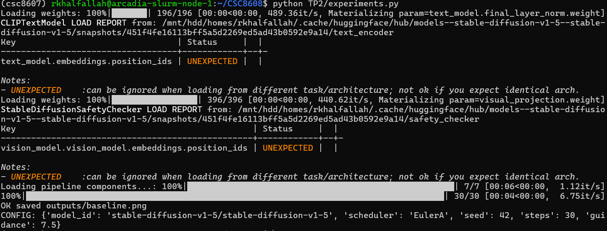

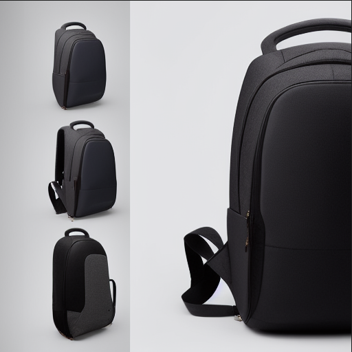

### Config 

#### 'model_id': 'stable-diffusion-v1-5'
#### 'scheduler': 'EulerA'
#### 'seed': 42
#### 'steps': 30
#### 'guidance': 7.5

## Exercice 3 : Text2Img : 6 expériences contrôlées (paramètres steps, guidance, scheduler)

| Run01 (EulerA, 30, 7.5) | Run02 (EulerA, 15, 7.5) | Run03 (EulerA, 50, 7.5) |
|---|---|---|
| 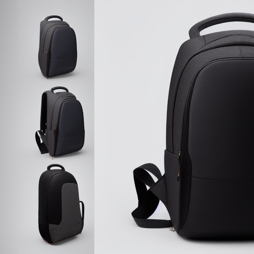 | 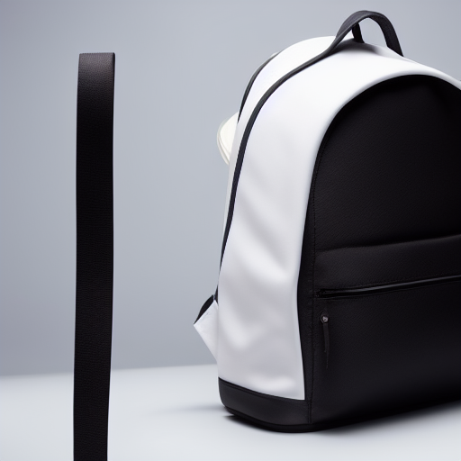 | 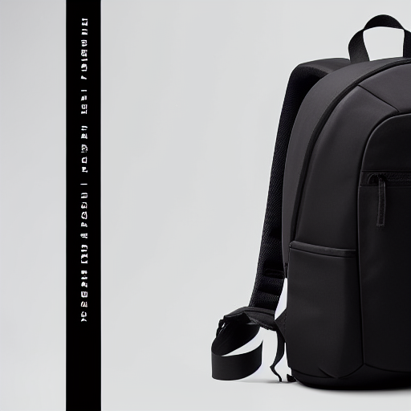 |
| Run04 (EulerA, 30, 4.0) | Run05 (EulerA, 30, 12.0) | Run06 (DDIM, 30, 7.5) |
|  | 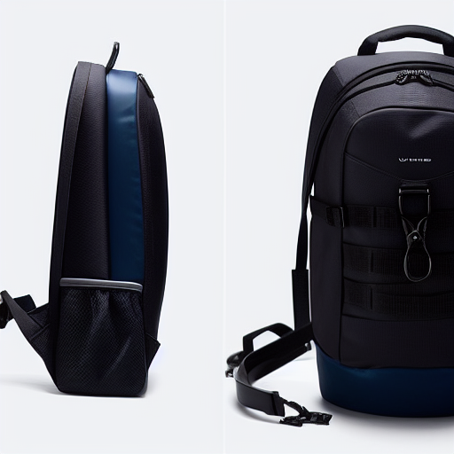 | 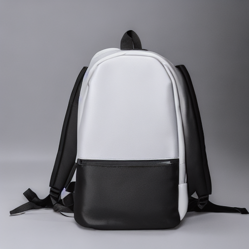 |

### Commentaires

Steps 15 à 50 : à 15 steps, on obtient plus vite une image mais avec moins de raffinement tandis que à 50 steps, l’image est généralement plus stabilisée et plus détaillée, avec un rendu plus fini, au prix d’un temps plus long.

Guidance 4.0 à 12.0 : à CFG=4, le modèle suit moins strictement le prompt ce qui donne plus de diversité mais parfois moins de composition et éclairage plus variables tandis que à CFG=12.0, l’adhérence au prompt est plus forte, mais le rendu peut devenir plus rigide et parfois introduire des artefacts ou textures moins naturelles.

Scheduler EulerA et DDIM : EulerA tend à donner un rendu plus contrasté tandis que DDIM produit souvent une image plus lisse et plus stable  avec parfois un rendu légèrement moins détaillé.

## Exercice 4 : Img2Img : 3 expériences contrôlées (strength faible/moyen/élevé)

### Img2Img — effet de `strength`

| Source | strength=0.35 | strength=0.60 | strength=0.85 |
|---|---|---|---|
| 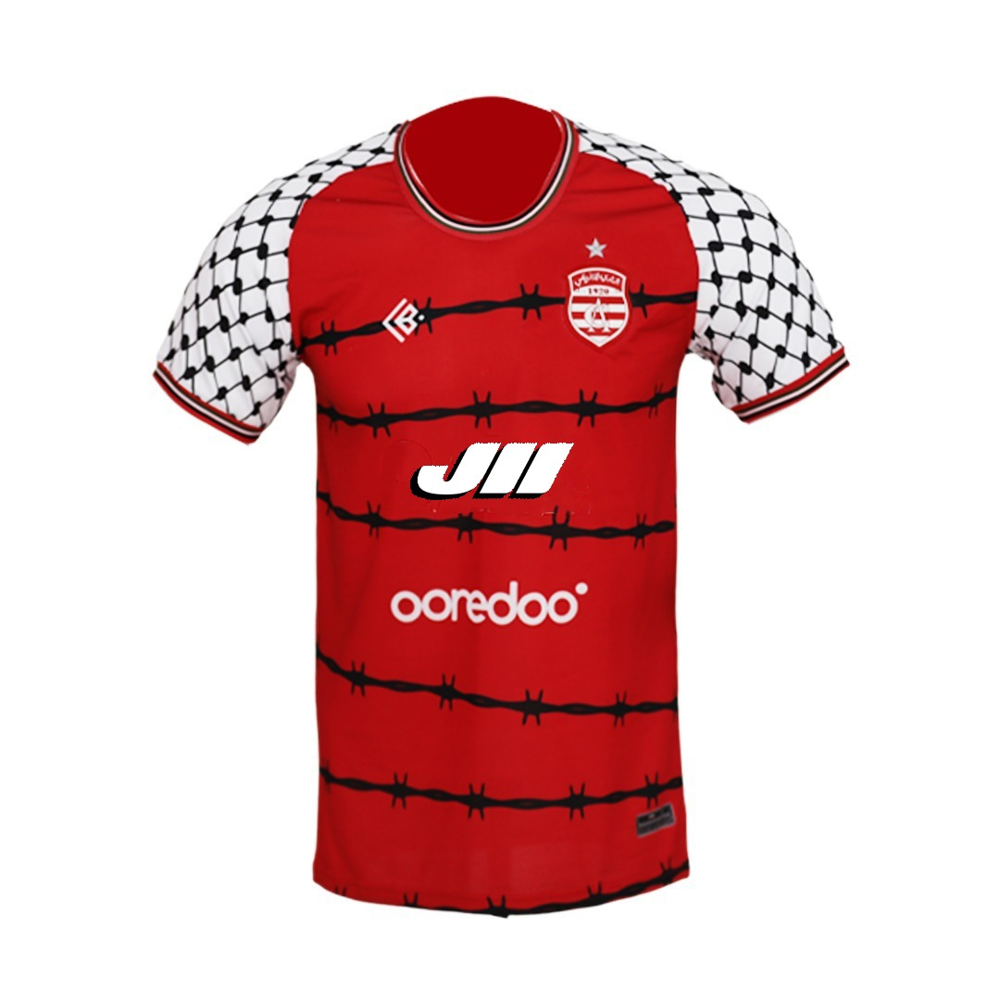 | 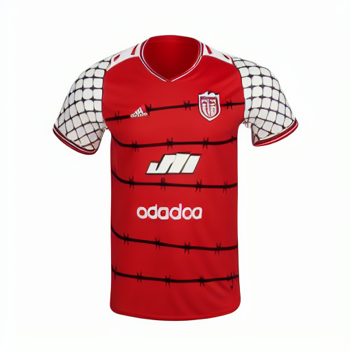 | 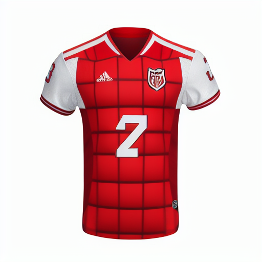 | 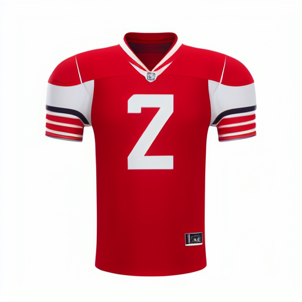 |

### Analyse comparative

- Ce qui est conservé

    - À 0.35, la forme globale du maillot et le cadrage sont largement conservés le modèle reste presque identique à l’image d’entrée.

    - À 0.60, l’identité produit reste reconnaissable, mais certains détails commencent à se réorganiser comme le logos.

    - À 0.85, l’objet reste un maillot mais l’identité exacte est fortement altérée.

- Ce qui change

    Quand strength augmente, les textures et les motifs évoluent davantage comme altération du sponsor et changement des manches.

    L’éclairage devient plus réinterprété à strength élevé.

    Les éléments sensibles comme le logo et le sponsor sont les premiers à dériver : à forte strength, ils deviennent souvent inventés ou déformés.

- Utilisabilité e-commerce

    0.35 est le plus adapté à l’e-commerce : retouche légère, amélioration de rendu sans trahir le produit.

    0.60 est un compromis : utile pour améliorer, mais risque de modifier certains détails de design.

    0.85 est risqué : la génération peut aller trop loin et produire un produit visuellement différent (problématique pour la fidélité catalogue).

## Exercice 5 : Mini-produit Streamlit (MVP) : Text2Img + Img2Img avec paramètres

### IMG2IMG
#### Input
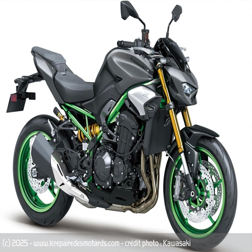
#### Output 
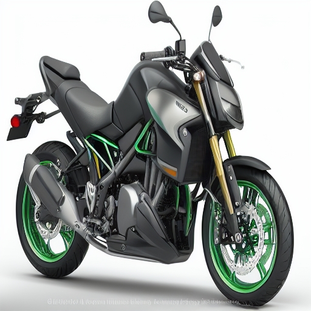
#### Config
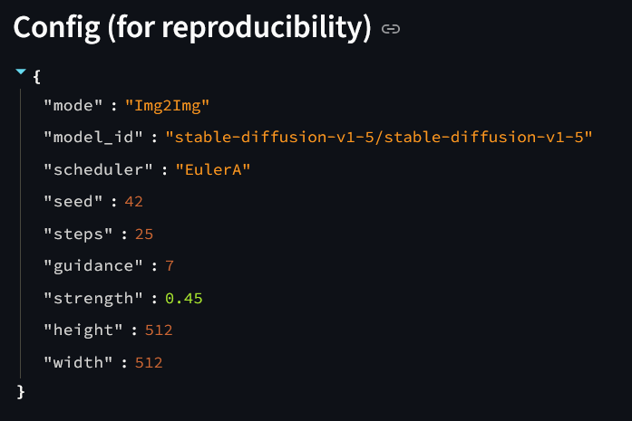

### TXT2IMG
#### Prompt 
ultra-realistic e-commerce product photo of a compact quadcopter drone, centered, front three-quarter view, white seamless studio background, softbox studio lighting, soft shadow, high detail, sharp focus, premium commercial photography
#### OUTPUT
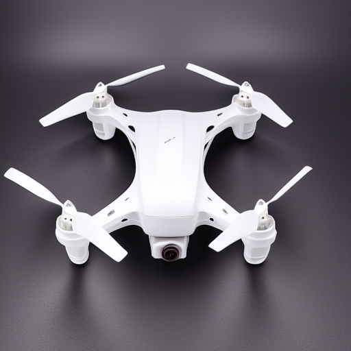
#### Config
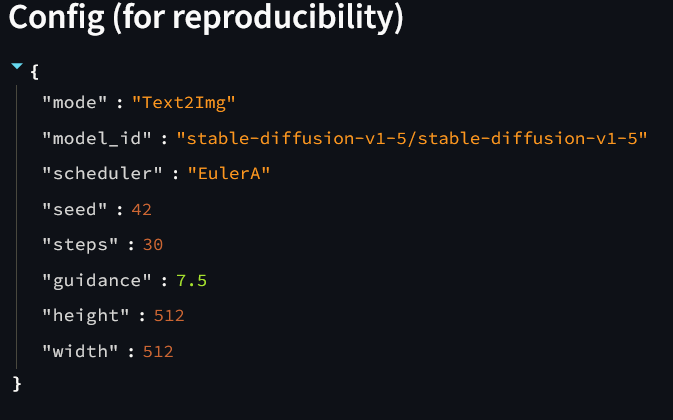

## Exercice 6 : Évaluation (léger) + réflexion 

## Évaluation

### Image A — Text2Img baseline (t2i_run01_baseline.png)
- Prompt adherence: 2
- Visual realism: 2
- Artifacts: 2
- E-commerce usability: 2
- Reproducibility: 2  
**Total: 10/10**
Justification :
- Packshot cohérent (produit centré et fond neutre).
- Peu d’artefacts visibles, rendu propre et catalogue.
- Paramètres (seed/steps/CFG/scheduler/prompt/negative) suffisants pour reproduire.

### Image B — Text2Img paramètre extrême (t2i_run05_guid12.png)
- Prompt adherence: 2
- Visual realism: 1
- Artifacts: 1
- E-commerce usability: 1
- Reproducibility: 2  
**Total: 7/10**
Justification :
- Le rendu suit fortement le prompt mais devient plus rigide.
- Risque d’artefacts ou de détails sur-optimisés.
- Encore reproductible car paramètres explicitement loggés.

### Image C — Img2Img strength élevé (i2i_run09_strength085.png)
- Prompt adherence: 1
- Visual realism: 1
- Artifacts: 1
- E-commerce usability: 0
- Reproducibility: 2  
**Total: 5/10**
Justification :
- Transformation trop forte : l’identité exacte du produit peut dériver (motifs ou logo).
- Apparition possible de détails inventés ou déformés (typique à strength élevé).
- Reproductible (seed,strength,steps,CFG,scheduler et image source), mais résultat risqué pour un catalogue.

### Synthèse
## Réflexion
Augmenter num_inference_steps améliore souvent la netteté et la stabilité visuelle, mais le coût augmente linéairement : au-delà d’un certain seuil, le gain devient marginal, et le choix du scheduler influence aussi ce compromis dont certains convergent plus vite ou produisent un rendu plus lisse. 

La reproductibilité repose sur un ensemble minimal de paramètres : modèle exact , scheduler, seed, steps, CFG, prompt, et en img2img l’image source et strength, elle peut être cassée par un changement de version de diffusers, de scheduler, ou de hardware. 

En e-commerce, le risque principal est l’hallucination : détails inventés, modification de design, et surtout déformation de logos ou texte, ce qui peut rendre l’image trompeuse. 

Pour limiter ces risques, je garderais des strength faibles en img2img, j’ajouterais des contrôles automatiques comme détection de logo, sanity checks sur la tailleou forme, un workflow humain de validation.

