# TP 3 : Deep learning pour audio

## Exercice 1 : Initialisation du TP3 et vérification de l’environnement

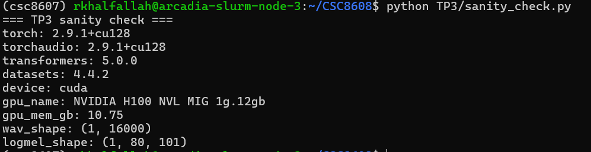


## Exercice 2 : Constituer un mini-jeu de données : enregistrement d’un “appel” (anglais) + vérification audio

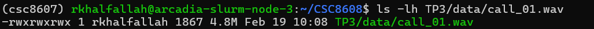

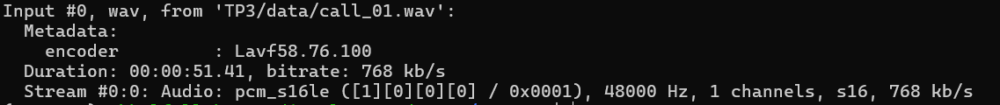

### Après conversion

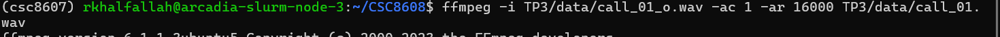

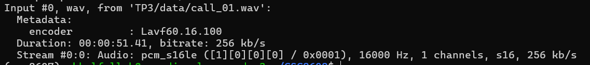

### Inspect audio

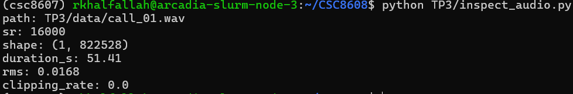


## Exercice 3 : VAD (Voice Activity Detection) : segmenter la parole et mesurer speech/silence

### Stats

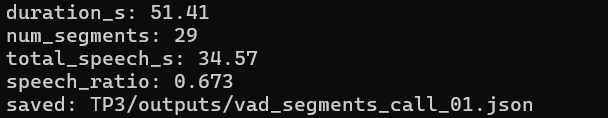

### Extrait de 5 segments start_s et end_s

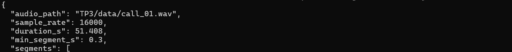

```
{
  "audio_path": "TP3/data/call_01.wav",
  "sample_rate": 16000,
  "duration_s": 51.408,
  "min_segment_s": 0.3,
  "segments": [
    {
      "start_s": 1.186,
      "end_s": 1.726
    },
    {
      "start_s": 2.37,
      "end_s": 4.734
    },
    {
      "start_s": 5.474,
      "end_s": 6.878
    },
    {
      "start_s": 7.362,
      "end_s": 9.182
    },
    {
      "start_s": 10.178,
      "end_s": 12.062
    },
```
### Analyse du ratio parole/silence 
Le VAD détecte 34,57 secondes de parole sur 51,41 secondes d’enregistrement, soit un speech_ratio de 0,673. Ce résultat me paraît cohérent avec ma manière de lire le texte dont ma lecture est globalement fluide et continue, mais elle contient des pauses naturelles liées à la respiration et aux transitions entre phrases. Le découpage obtenu en 29 segments va dans ce sens, car il traduit une segmentation en blocs de parole séparés par de courts silences.

### Filtrage plus strict 'min_dur_s = 0.60'

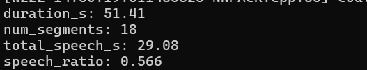

| Métrique        | min_dur_s = 0.30 | min_dur_s = 0.60 |
|----------------|------------------:|------------------:|
| num_segments   | 29                | 18                |
| total_speech_s | 34.57             | 29.08             |
| speech_ratio   | 0.673             | 0.566             |


En passant de min_dur_s=0.30 à 0.60, le VAD devient plus strict : il produit moins de segments (29 vers 18) et détecte moins de parole (speech_ratio 0.673 vers 0.566).


## Exercice 4 : ASR avec Whisper : transcription segmentée + mesure de latence

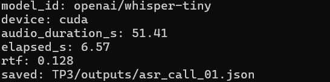


### Extrait 'asr_call_01.json'

```
"segments": [
    {
      "segment_id": 0,
      "start_s": 1.186,
      "end_s": 1.726,
      "text": "Hello."
    },
    {
      "segment_id": 1,
      "start_s": 2.37,
      "end_s": 4.734,
      "text": "Thank you for calling customer support."
    },
    {
      "segment_id": 2,
      "start_s": 5.474,
      "end_s": 6.878,
      "text": "My name is Alex."
    },
    {
      "segment_id": 3,
      "start_s": 7.362,
      "end_s": 9.182,
      "text": "and I will help you today."
    },
    {
      "segment_id": 4,
      "start_s": 10.178,
      "end_s": 12.062,
      "text": "I am calling about an order."
    },

```

### Full text 

"Hello. Thank you for calling customer support. My name is Alex. and I will help you today. I am calling about an order. but arrive at Damage. The package was delivered this day. Thank you for watching! I would like a refund. or a replacement as soon as possible. for order number is. A. EX? One. Bye. free. Five. You can reach me. Up. John.smith. At Example. dot com. Also, my phone number is... Five. Bye. Bye. 0-1. Nine, nine. Thank you."

### Analyse

La segmentation VAD aide la transcription, car elle évite les longs silences et structure l’audio en segments courts, avec une latence faible (RTF ≈ 0,128). En revanche, elle peut dégrader la transcription des informations courtes comme l'e-mail et le num de téléphone lorsque les coupures tombent au milieu d’un mot ou d’une séquence épelée.

## Exercice 5 : Call center analytics : redaction PII + intention + fiche appel

### Exécution de callcenter_analytics.py

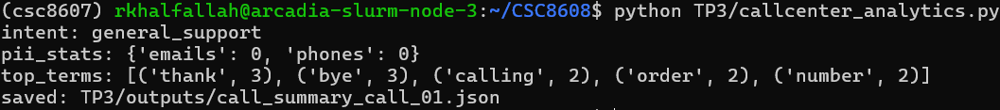

### Extrait du JSON

```
{
  "audio_path": "TP3/data/call_01.wav",
  "model_id": "openai/whisper-tiny",
  "device": "cuda",
  "audio_duration_s": 51.408,
  "elapsed_s": 6.565676212310791,
  "rtf": 0.1277170131557499,
  "pii_stats": {
    "emails": 0,
    "phones": 0
  },
  "intent_scores": {
    "refund_or_replacement": 2,
    "delivery_issue": 4,
    "general_support": 7
  },
  "intent": "general_support",
  "top_terms": [
    [
      "thank",
      3
    ],
    [
      "bye",
      3
    ],
    [
      "calling",
      2
    ],
    [
      "order",
      2
    ],
    [
      "number",
      2
    ],
```

### Version améliorée

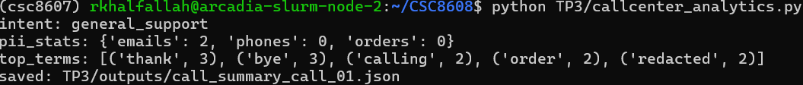

```
{
  "audio_path": "TP3/data/call_01.wav",
  "model_id": "openai/whisper-tiny",
  "device": "cuda",
  "audio_duration_s": 51.408,
  "elapsed_s": 6.565676212310791,
  "rtf": 0.1277170131557499,
  "pii_stats": {
    "emails": 2,
    "phones": 0,
    "orders": 0
  },
  "intent_scores": {
    "refund_or_replacement": 2,
    "delivery_issue": 4,
    "general_support": 7
  },
  "intent": "general_support",
  "top_terms": [
    [
      "thank",
      3
    ],
    [
      "bye",
      3
    ],
    [
      "calling",
      2
    ],
    [
      "order",
      2
    ],
    [
      "redacted",
      2
    ],
```
### Comparaison des résultats

La version enrichie introduit un post-traitement heuristique avant les analytics afin de mieux gérer les PII “parlées” et les sorties ASR bruitées :

- preclean : nettoyage de base (séparation chiffres/lettres collés, ponctuation collée, compactage des espaces)

- normalize_spelled_tokens : normalisation des formes orales (dot → ., at → @, mots de chiffres → chiffres)

- redact_order_id : tentative de masquage contextuel après “order number is”

- redact_spoken_email : redaction d’e-mail via regex standard puis fallback contextuel (“reach me” / “you can reach me”)

- redact_phone : masquage des suites de chiffres avec séparateurs optionnels

| Métrique | Version initiale | Version améliorée |
|---|---:|---:|
| emails | 0 | 2 |
| phones | 0 | 0 |
| orders | — | 0 |

Dans mon essai, la normalisation des tokens parlés a bien aidé à mieux repérer la zone de l’e-mail, alors que la version initiale ne détectait rien. En revanche, le résultat reste imparfait : 2 e-mails sont détectés pour 1 attendu, ce qui indique un faux positif. Le téléphone et l’identifiant de commande ne sont toujours pas détectés, car la transcription Whisper les fragmente trop fortement a cause d chiffres mal séparés.


### Réflexion sur les erreurs ASR et l'impact sur les analytics

Les erreurs Whisper les plus pénalisantes sont celles sur les séquences épelées (order ID, e-mail et téléphone), car elles cassent directement la détection PII par regex. Par exemple, l’identifiant “A X 1 9 7 3 5” devient “A. EX? One. Bye. free. Five.”, donc il n’est pas reconnu comme order number. 
Le téléphone est aussi fragmenté (“Five. Bye. Bye. 0-1. Nine, nine.”), ce qui empêche sa détection. 
Coté intention, certaines erreurs lexicales (ex. “arrive at Damage” au lieu de arrived damaged) peuvent réduire les scores de mots-clés métier. 
Malgré cela, les mots fréquents comme support et calling, restent assez bien reconnus pour conserver l’intention globale.


## Exercice 6 : TTS léger : générer une réponse “agent” et contrôler latence/qualité


### tts_model_id, audio_dur_s, elapsed_s, rtf

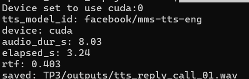

### Métadonnées du WAV 

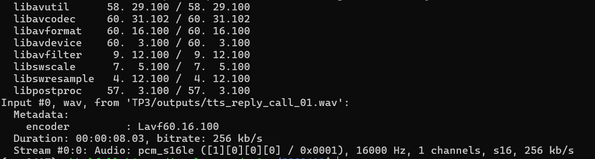

### observation sur la qualité TTS

La synthèse TTS générée avec facebook/mms-tts-eng est globalement intelligible : le message reste compréhensible et les phrases principales sont bien restituées. 
La prosodie est correcte pour un prototype, mais elle reste assez neutre, avec une intonation peu naturelle. 
On peut percevoir de légers artefacts métalliques typiques d’un TTS léger, sans coupures majeures sur cet essai. 
Côté latence, le résultat est bon : 8,03 s d’audio sont générées en 3,24 s (RTF = 0,403), donc la génération est plus rapide que le temps réel.

### L’intelligibilité de la TTS via ASR

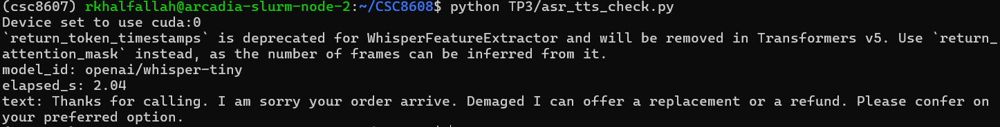

La transcription ASR du fichier TTS est globalement identique au texte source, ce qui indique une bonne intelligibilité de la synthèse vocale.
On observe  quelques erreurs mineures, par exemple “arrive. Demaged” au lieu de “arrived damaged” et “Please confer on” au lieu de “Please confirm”. 
Ces erreurs n’empêchent pas la compréhension du message, mais montrent que certains mots sont moins nets.
Dans l’ensemble, la qualité TTS est suffisante pour un prototype de réponse “agent”.

## Exercice 7 : Intégration : pipeline end-to-end + rapport d’ingénierie (léger)

### Pipeline summary


### Extrait du JSON de synthèse

```

 "audio_path": "TP3/data/call_01.wav",
  "duration_s": 51.408,
  "num_segments": 29,
  "speech_ratio": 0.6725023342670401,
  "asr_model": "openai/whisper-tiny",
  "asr_device": "cuda",
  "asr_rtf": 0.06716083207681028,
  "intent": "general_support",
  "pii_stats": {
    "emails": 2,
    "phones": 0,
    "orders": 0
  },
  "tts_generated": true
```
### Engineering note

- Goulet d’étranglement principal (temps) : 

  Le goulet d’étranglement principal est l’étape ASR Whisper, car c’est elle qui traite la majorité de l’audio utile dont tous les segments VAD et réalise l’inférence la plus coûteuse. 
  Dans mon cas, l’ASR reste rapide sur GPU (RTF ≈ 0,067), donc ce n’est pas bloquant en prototype, mais c’est malgré tout l’étape la plus lourde du pipeline en calcul. 

- Étape la plus fragile (qualité) :

  L’étape la plus fragile en qualité est aussi l’ASR, surtout sur les informations épelées (e-mail et numéro de téléphone). 
  Whisper fragmente ou déforme ces séquences (lettres et chiffres isolés), ce qui dégrade ensuite la redaction PII et certaines heuristiques d’analytics. 
  On le voit dans mes résultats avec des PII mal détectées (emails=2, phones=0, orders=0) et des faux positifs.

- Deux améliorations concrètes pour industrialiser (sans entraîner de modèle) :

  - Renforcer le post-traitement métier : règles plus strictes et contextuelles pour reconstruire les séquences épelées (téléphone et e-mail), plus filtrage des faux positifs avant les analytics.

  - Précharger ou mettre en cache les modèles et pipelines (Whisper, TTS, VAD) :cache local HF, et réutilisation des instances pour réduire la latence de démarrage et stabiliser les temps d’exécution.