# TP 4 : Deep learning pour audio Graph Neural Networks

## Exercice 1 : Initialisation du TP et smoke test PyG (Cora)

### Arborescence 

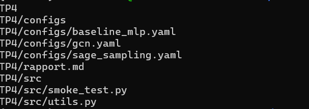

### Environnement

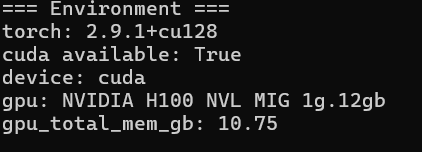


### Stats de Cora

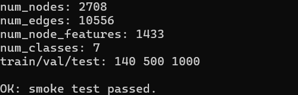

## Exercice 2 : Baseline tabulaire : MLP (features seules) + entraînement et métriques


On calcule les métriques séparément sur train, val et test pour distinguer apprentissage, réglage et évaluation finale. Le score sur train_mask indique si le modèle apprend bien les exemples vus. Le score sur val_mask sert à suivre la généralisation pendant les epochs (et, plus tard, à comparer des hyperparamètres sans “tricher”). Le score sur test_mask doit rester une mesure finale, utilisée pour comparer les modèles (MLP vs GCN vs GraphSAGE) dans des conditions équitables. En pratique ingénieur, cette séparation évite de surinterpréter un bon score d’entraînement qui ne se transfère pas aux nœuds non vus.


### Configurations

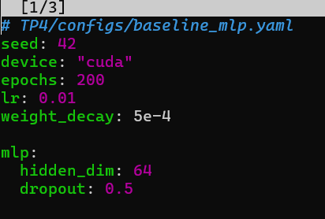

### Métriques finales (Accuracy et Macro-F1 sur test) et total_train_time_s

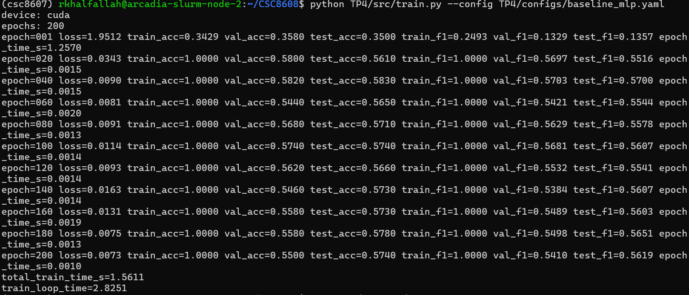

## Exercice 3 : Baseline GNN : GCN (full-batch) + comparaison perf/temps

### Modèle MLP

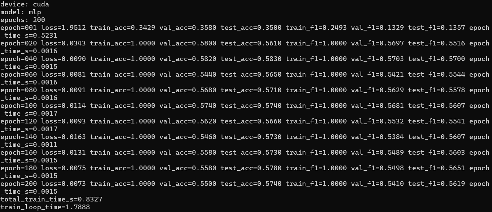

### Modèle GCN

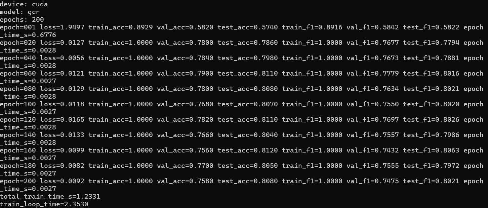


### Tableau de comparaison

| Modèle | test_acc | test_f1 (macro) | total_train_time_s |
|---|---:|---:|---:|
| MLP (features seules) | 0.5740 | 0.5619 | 0.8327 |
| GCN (full-batch) | 0.8080 | 0.8021 | 1.2331 |


Le GCN dépasse  le MLP car il exploite la structure du graphe en plus des features des nœuds. Sur Cora, les nœuds connectés appartiennent souvent à des classes proches  donc l’agrégation des voisins apporte un signal utile pour la classification. 
Le MLP, lui, ne voit que les features individuelles et ignore complètement les relations entre nœuds tandis que le GCN réalise un lissage local qui renforce les informations pertinentes autour de chaque nœud, ce qui améliore la généralisation sur val/test. 
On observe bien ce gain avec une forte hausse de test_acc et de macro_f1. 
En contrepartie, le GCN est un peu plus coûteux en temps que le MLP, mais le surcoût reste modéré sur Cora.

## Exercice 4 :Modèle principal : GraphSAGE + neighbor sampling (mini-batch)

### Modèle GraphSAGE

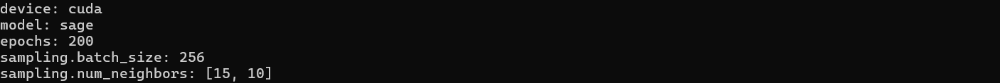

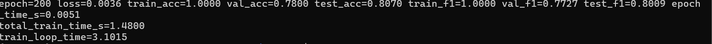

### Tableau comparatif

| Modèle | test_acc | test_f1 (macro) | total_train_time_s |
|---|---:|---:|---:|
| MLP  | 0.5740 | 0.5619 | 0.8327 |
| GCN | 0.8080 | 0.8021 | 1.2331 |
| GraphSAGE | 0.8070 | 0.8009 | 1.4162 |


Le neighbor sampling permet d’entraîner GraphSAGE en mini-batch sans traiter tout le graphe à chaque itération. On échantillonne seulement un voisinage local autour des nœuds d’apprentissage (ici fanout [15, 10]), ce qui réduit le coût mémoire et rend l’approche scalable sur de grands graphes. En revanche, le gradient est estimé à partir d’un sous-graphe partiel : il est donc plus bruité qu’en full-batch, ce qui peut augmenter la variance et légèrement dégrader la performance si le fanout est trop faible. Le choix du fanout est un compromis : trop petit → perte d’information, trop grand → coût plus élevé. Les nœuds à fort degré (hubs) peuvent aussi rendre le sampling plus coûteux. Enfin, sur un petit dataset comme Cora, le coût CPU du NeighborLoader et les transferts mini-batch peuvent annuler le bénéfice en temps, ce qui explique un temps d’entraînement ici légèrement supérieur au GCN full-batch malgré des performances similaires.

## Exercice 5 : Benchmarks ingénieur : temps d’entraînement et latence d’inférence (CPU/GPU)

### MLP
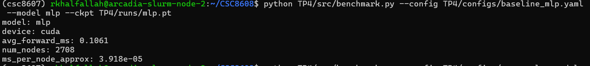

### GCN
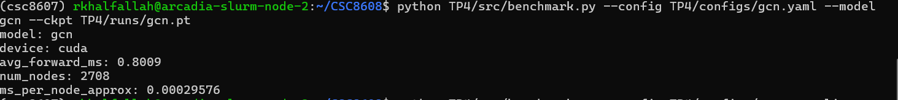

### GraphSAGE

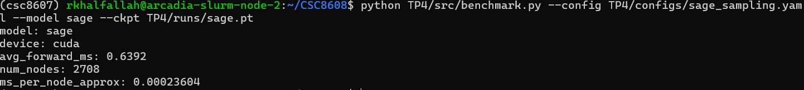

### Tableau synthétique

| Modèle | test_acc | test_f1 (macro) | total_train_time_s | avg_forward_ms |
|---|---:|---:|---:|---:|
| MLP | 0.5740 | 0.5619 | 0.8327 | 0.1016 |
| GCN | 0.8080 | 0.8021 | 1.2331 | 0.8009 |
| GraphSAGE | 0.8070 | 0.8009 | 1.4162 | 0.6392 |


On fait un warmup avant de mesurer la latence, car les premiers forwards GPU sont souvent plus lents comme initialisation CUDA et chargement de kernels. 

Sans warmup, la mesure serait biaisée et peu représentative du régime stable. On synchronise CUDA avant et après la mesure car l’exécution GPU est asynchrone : PyTorch peut retourner le contrôle au CPU avant que le calcul GPU soit réellement terminé. 

Si on ne synchronise pas, on mesure surtout le temps de lancement des kernels, pas le temps réel d’inférence. 

La synchronisation force le CPU à attendre la fin du travail GPU, ce qui rend avg_forward_ms fiable. Ces précautions améliorent la stabilité et la comparabilité des benchmarks entre modèles.

## Exercice 6 : Synthèse finale : comparaison, compromis, et recommandations ingénieur

### Synthèse finale — Tableau comparatif

| Modèle      | test_acc | test_macro_f1 | total_train_time_s | train_loop_time | avg_forward_ms |
|------------|----------:|--------------:|-------------------:|----------------:|---------------:|
| MLP        | 0.5740    | 0.5619        | 0.8327             | 1.7888          | 0.1016      |
| GCN        | 0.8080    | 0.8021        | 1.2331             | 2.3530          | 0.8009       |
| GraphSAGE  | 0.8070    | 0.8009        | 1.4162             | 2.9204          | 0.6392       |

### Recommandation

Sur Cora, je ne choisirais pas le MLP si l’objectif principal est la qualité, car ses performances sont nettement plus faibles (test_acc = 0.5740, macro-F1 = 0.5619) malgré un coût d’entraînement plus faible (total_train_time_s = 0.8327 s).

Le GCN offre le meilleur compromis dont il atteint la meilleure qualité (test_acc = 0.8080, macro-F1 = 0.8021) avec un temps d’entraînement encore modéré (1.2331 s).

Le GraphSAGE obtient une qualité très proche du GCN (0.8070 vs 0.8009), mais avec un coût d’entraînement légèrement supérieur ici (1.4162 s), ce qui est attendu sur un petit graphe où le sampling n’apporte pas encore un gain net.

Je choisirais donc GCN pour un graphe de taille modérée et une comparaison simple full-batch.

Je choisirais GraphSAGE si je vise une montée en charge vers de plus grands graphes (mini-batch, neighbor sampling), même si le gain de temps n’est pas visible sur Cora.
Je garderais MLP comme baseline rapide  pour vérifier la valeur ajoutée du graphe.


### Risque de protocole

Un risque important de ce TP est de comparer des mesures qui ne sont pas strictement homogènes (par exemple exécution GPU pour un modèle et CPU pour un autre). Cela peut fausser la comparaison de latence et donner un avantage artificiel à certains modèles. 
Un autre risque est la variabilité due à la seed (initialisation, dropout, sampling GraphSAGE), qui peut faire varier légèrement Accuracy ou Macro-F1. Dans un vrai projet, je fixerais la seed, je répéterais chaque expérience sur plusieurs runs (ex. 3–5 seeds) et je rapporterais moyenne. Je m’assurerais aussi d’utiliser la même version logicielle, et le même protocole de mesure (warmup, synchronisation, nombre de runs) pour tous les modèles. 
Enfin, je vérifierais qu’aucun artefact de checkpoint ne biaise les temps mesurés.


                                                    ``` Je confirme que je n’ai pas commité de fichiers volumineux ```