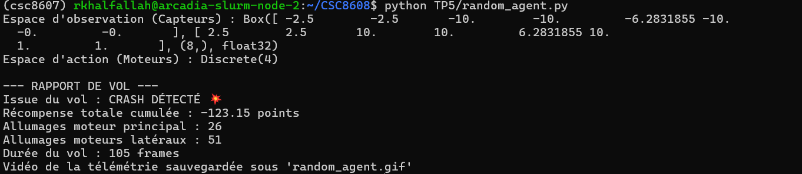
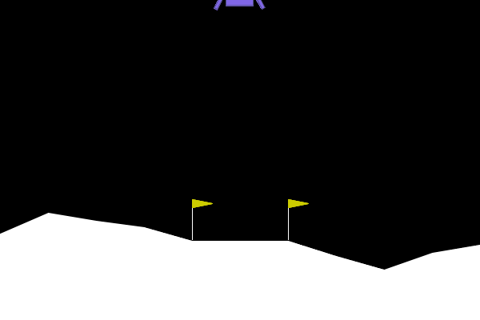
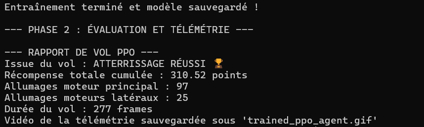
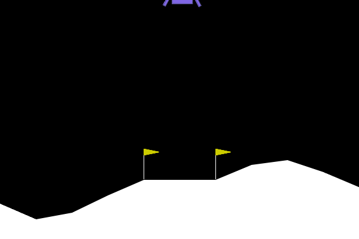
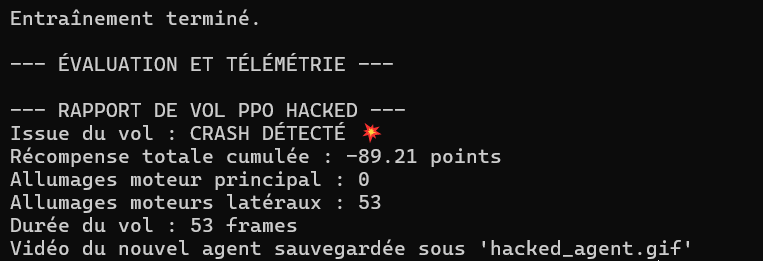
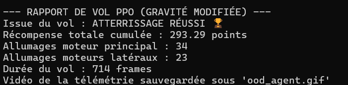
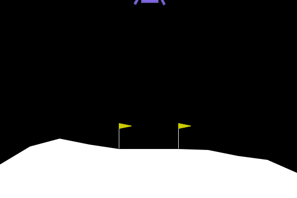

# TP 5 : Deep Reinforcement Learning

## Exercice 1 : Comprendre la Matrice et Instrumenter l'Environnement (Exploration de Gymnasium)

### Rapport de vol 

### GIF généré

L’agent aléatoire obtient un crash et une récompense totale de '-123.15'.

## Exercice 2 : Entraînement et Évaluation de l'Agent PPO (Stable Baselines3)

### Rapport de vol

### Nouveau GIF

Pendant l’entraînement la 'ep_rew_mean' démarre environ '-179' au début puis augmente régulièrement.
Elle devient positive vers 92k timesteps et dépasse le seuil de résolution '200' vers 147k timesteps,
et atteint a la fin d'entrainement '253'.

Comparé à l’agent aléatoire crash qui a un score '-123.15', l’agent PPO atterrit avec succès et obtient '310' de score.
On observe une réduction nette des allumages latéraux (de 51 vers 25), signe d’un meilleur contrôle et de moins de corrections inutiles.
Le moteur principal est davantage utilisé (de 26 vers 97), correspondant à une descente stabilisée.

## Exercice 3 : L'Art du Reward Engineering (Wrappers et Hacking)

### Rappot de vol

### GIF généré

Le wrapper impose une pénalité supplémentaire de -50 dès que l’action 2 est choisie. L’agent apprend donc à éviter presque totalement cette action : dans mon run, il n’utilise pas le moteur principal (0 allumage), tente uniquement des corrections latérales, puis crashe rapidement.

De plus l’agent cherche à maximiser sa récompense selon les règles modifiées.Tandis que, utiliser le moteur principal plusieurs fois pour réussir un atterrissage devient très coûteux à cause de la pénalité. Il peut donc être plus rentable du point de vue du score de crasher en évitant le moteur principal plutôt que de réussir un atterrissage qui nécessiterait plusieurs activations pénalisées. 

## Exercice 4 : Robustesse et Changement de Physique (Généralisation OOD)

### Rapport 

### GIF généré

Avec la gravité réduite '-2', l’agent parvient toujours à se poser et obtient un score élevé environ 240, donc il réussit globalement la mission. 

Cependant, le comportement est moins naturel et moins efficace dont le vol dure très longtemps ' 714 frames', ce qui traduit une phase d’approche prolongée avec des ajustements répétés avant de toucher le sol. 

Techniquement, c’est un effet classique de généralisation OOD dont la politique PPO a été apprise sous une dynamique de gravité d’entraînement, et quand la gravité change, la relation entre action et conséquence n’est plus la même. 

Les seuils et timings appris pour freiner, stabiliser l’angle et contrôler la vitesse verticale deviennent mal calibrés, ce qui oblige l’agent à compenser par plus de micro-corrections et de prudence. 

De plus, le modèle ne comprend pas la physique il applique des réflexes optimisés pour son environnement, ce qui peut mener à des oscillations et parfois un échec dans qlqs essais, même si l’atterrissage est réussi.

## Exercice 5 : Bilan Ingénieur : Le défi du Sim-to-Real

### Stratégie 1 : Fine-tuning léger

- Garder un modèle PPO de base et effectuer une courte phase d’adaptation sur une nouvelle lune avec très peu de steps, sans stocker un modèle par lune :

    - Réaliser 5k–20k timesteps de continual learning sur la nouvelle gravité vent, puis conserver un seul modèle mis à jour 'globalement'.

    - Cette approche est moins coûteuse qu’un réentraînement complet from scratch et pratique lorsqu’on découvre de nouvelles conditions en production.
    - 
### Stratégie 2 : Curriculum Learning (apprentissage progressif)

- Entraîner un seul modèle PPO en augmentant progressivement la difficulté des conditions physiques, au lieu de le confronter directement à une grande variabilité :

    - Commencer avec la configuration standard (gravité fixe, peu ou pas de vent), puis élargir petit à petit la plage de gravité et introduire du vent/turbulences.

    - Cela stabilise l’apprentissage et évite que le modèle panique face à des dynamiques  différentes dès le départ.

    - L’agent apprend une politique plus robuste, car il a vu des variations de plus en plus larges pendant l’entraînement, sans nécessiter un modèle différent pour chaque lune.
