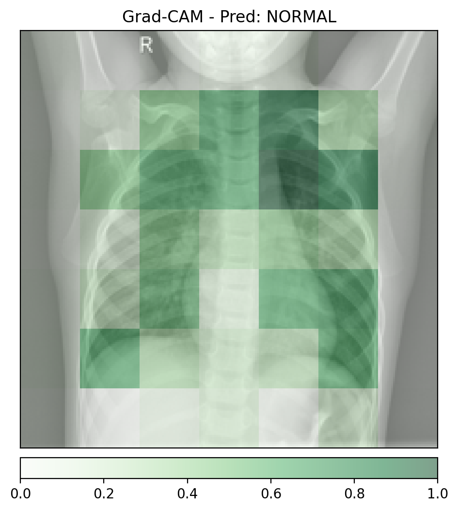
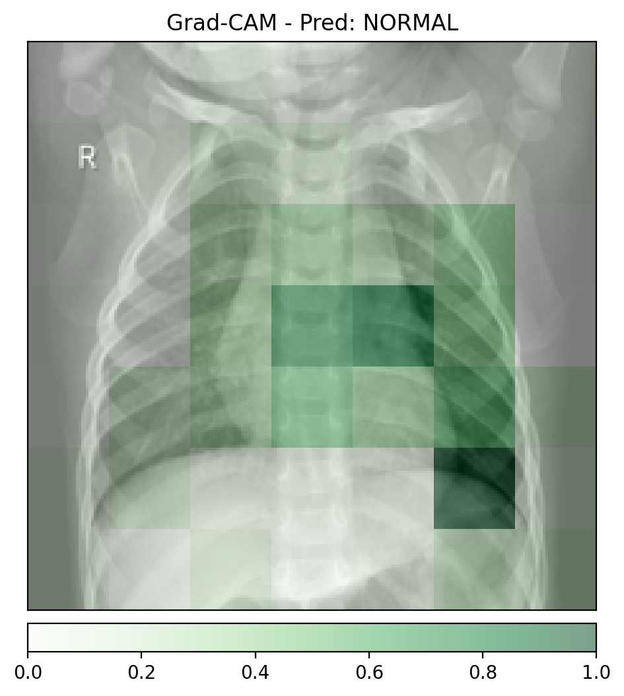
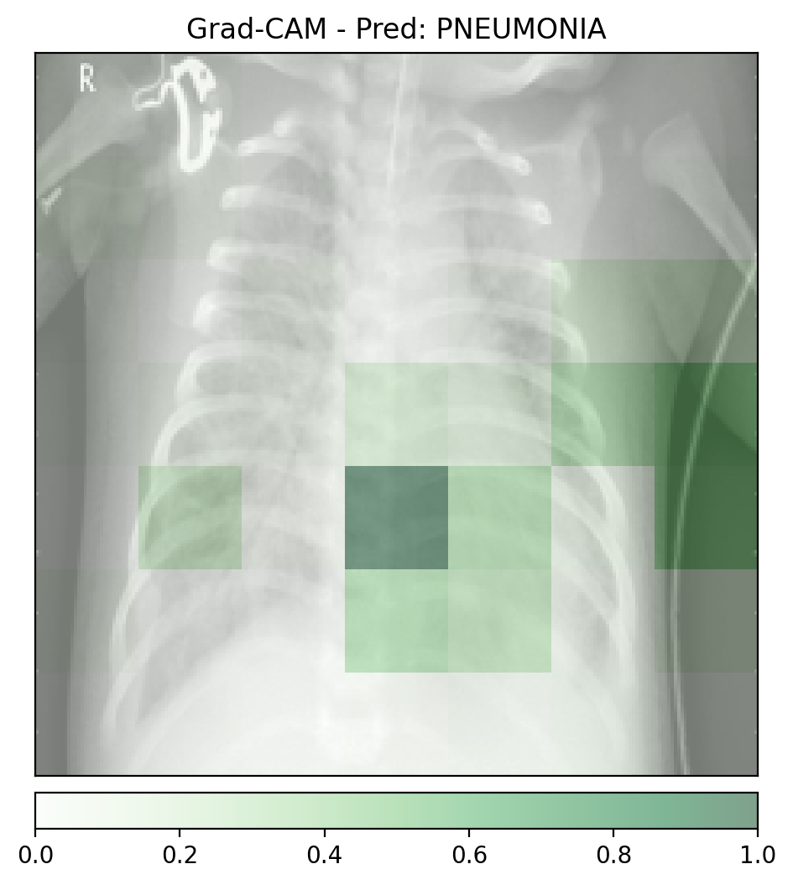
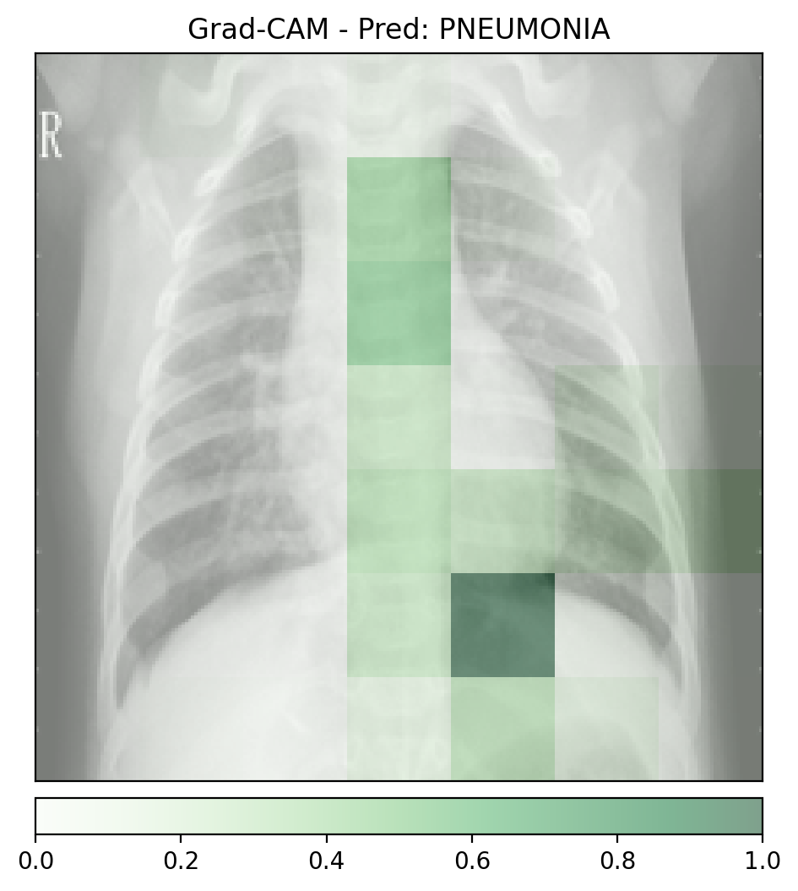
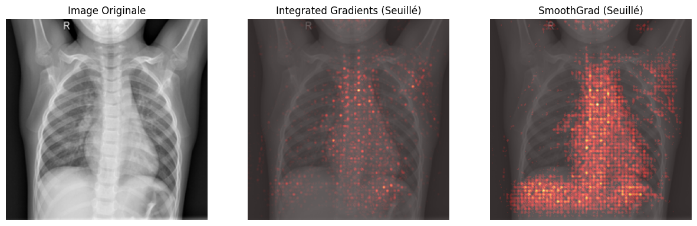
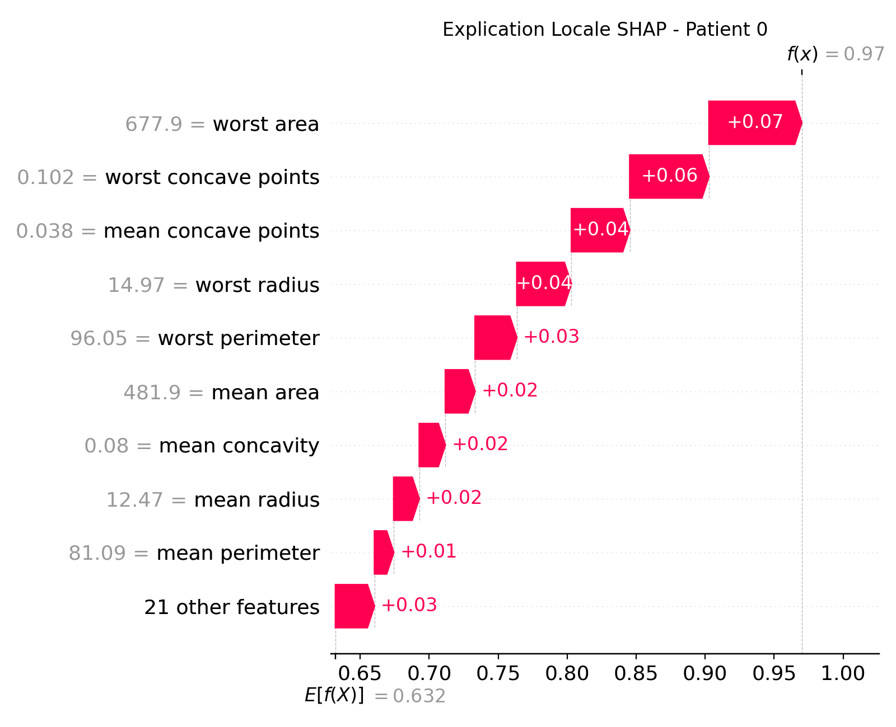
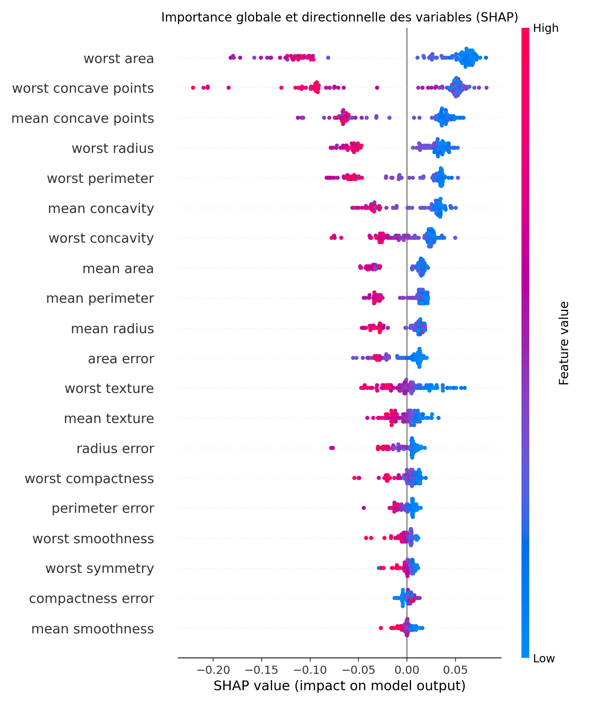

# TP 6 : IA Explicable et Interprétable

## Exercice 1 : Mise en place, Inférence et Grad-CAM

### Images Grad-CAM générées 

#### Gradcam_normal_1



#### Gradcam_normal_2



#### Gradcam_pneumo_1



#### Gradcam_pneumo_2



#### Analyse des Faux Positifs

Les deux radiographies saines (normal_1, normal_2) sont classées NORMAL donc aucun faux positif n’a été observé sur cet échantillon.  
En revanche, l’analyse Grad-CAM montre un risque de dépendance à des artefact où sur certaines images classées PNEUMONIA, la zone mise en évidence ne se limite pas aux champs pulmonaires et peut déborder vers des régions non médicales tels que les bords très sombreset la présence possible d’objets. Cela suggère que le modèle pourrait exploiter des indices corrélés au label, ce qui est compatible avec un comportement de type Clever Hans.

#### Granularité

Les cartes Grad-CAM sont de faible résolution dont les zones activées apparaissent sous forme de gros blocs plutôt que de contours fins.  
Cela vient du fait que Grad-CAM est calculé sur la dernière couche convolutionnelle du ResNet. 
A ce niveau, l’image a été fortement sous-échantillonnée (strides et pooling) au fil du réseau où la feature map finale a une résolution spatiale faible, puis elle est interpolée pour être superposée à l’image d’origine, d’où l’aspect flou.

## Exercice 2 :Integrated Gradients et SmoothGrad

### Image comparative générée



### Temps d’exécution
```
Temps IG pur : 0.5428s
Temps SmoothGrad (IG x 100) : 13.7817s

```

SmoothGrad est '25×' plus lent que IG , donc il est peu réaliste de générer cette explication synchrone en consultation, car le médecin attend une réponse quasi immédiate.

### Architecture

Retourner la prédiction immédiatement, puis envoyer la génération SmoothGrad dans une file de tâches traitée par un worker GPU asynchrone qui renvoie l’explication dès qu’elle est prête via une notification.

### Intérêt d’une attribution signée

Une carte qui peut descendre sous zéro distingue les pixels qui augmentent le score de la classe de ceux qui le diminuent .  
À l’inverse, Grad-CAM applique un ReLU et supprime les contributions négatives donc on perd l’information sur ce qui contredit la prédiction, ce qui rend l’explication moins complète.

## Exercice 3 :Modélisation Intrinsèquement Interprétable (Glass-box) sur Données Tabulaires

### Glassbox


### Feature la plus influente vers "Maligne" (classe 0) :  

```
worst texture car il possède le coefficient le plus négatif en valeur absolue

``` 
### Avantage glass-box

Un modèle glass-box est interprétable directement via ses coefficients , sans avoir besoin d’une méthode post-hoc approximative comme Grad-CAM ou IG.

### Explicabilité Post-Hoc avec SHAP sur un Modèle Complexe

## Exercice 4 :Explicabilité Post-Hoc avec SHAP sur un Modèle Complexe

### Shap_waterfall



### Shap_summary



### Explicabilité Globale

les top 3 variables SHAP sont :worst area , worst concave points , mean concave points.
Ces 3 variables ne sont pas exactement les mêmes que la régression logistique où worst texture dominait, mais elles restent des biomarqueurs très cohérents liés à la taille et à la forme de la tumeur. On en déduit que les caractéristiques taille et concavité sont robustes et fortement discriminantes quel que soit le modèle, tandis que certaines variables comme la texture peuvent être plus modèle-dépendantes.

### Explicabilité Locale

Pour le patient 0, la caractéristique ayant le plus contribué à la prédiction est worst area, avec une valeur de 677.9 et contribution SHAP = +0.07.


